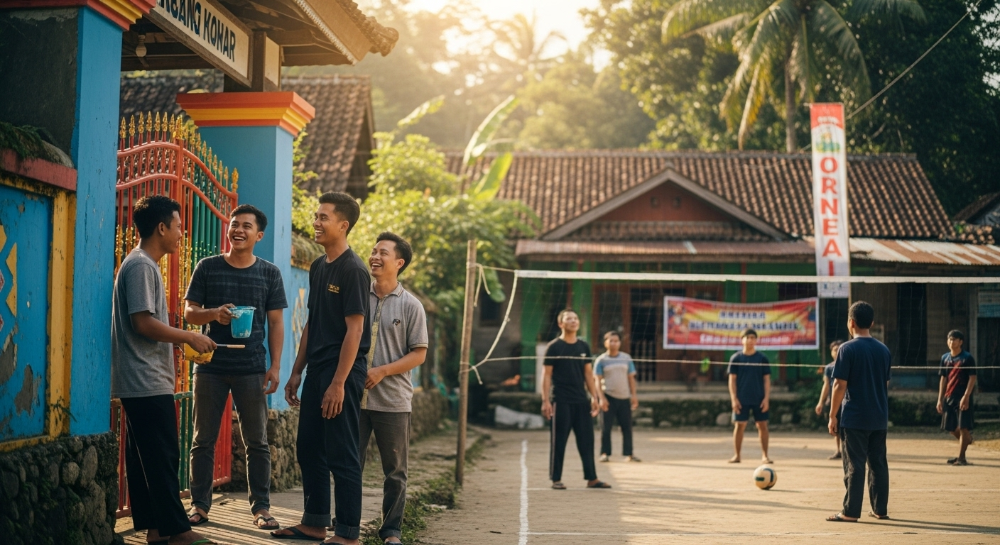
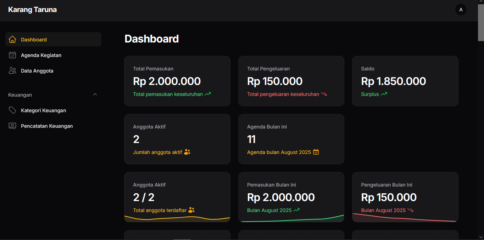
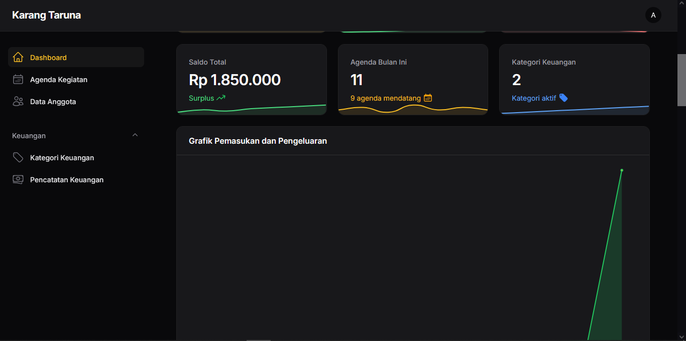
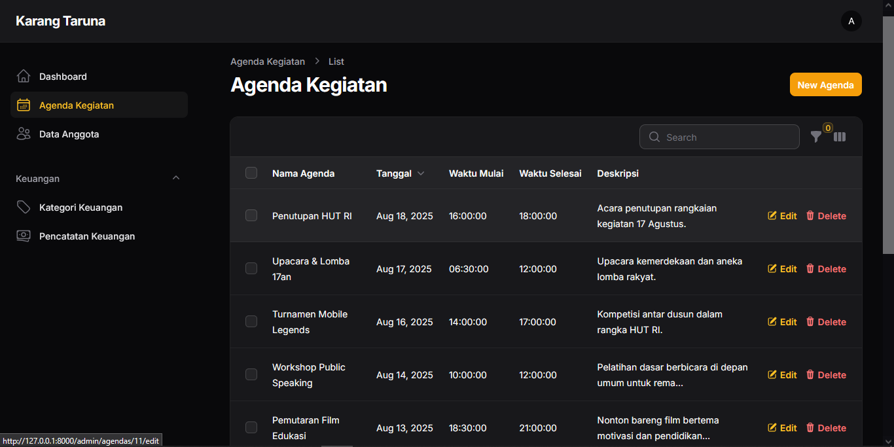
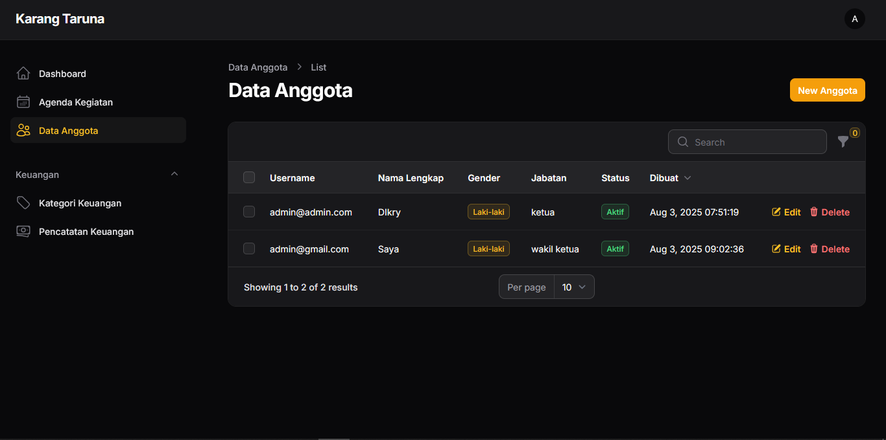
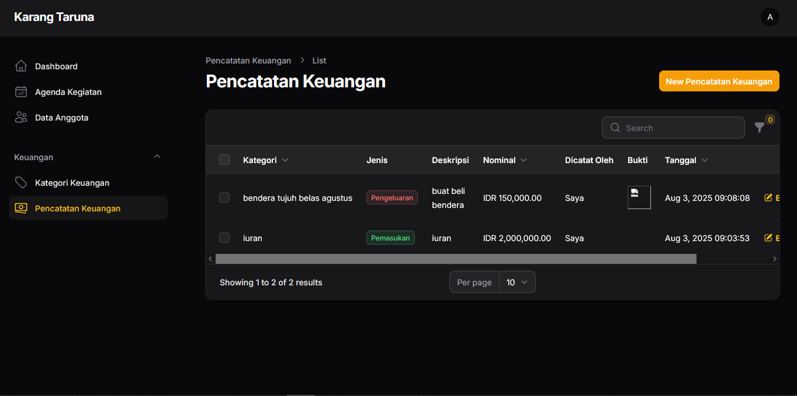

<p align="center">
 <h2 align="center">KarangTarunaGO</h2>
 <p align="center">Manajemen Kegiatan Pemuda Dusun</p>

</p>

> [!Laravel]\
> Framework PHP yang populer untuk membangun aplikasi web modern dengan arsitektur MVC (Model-View-Controller). Laravel menyediakan sintaks yang elegan, fitur bawaan seperti routing, autentikasi, dan ORM Eloquent untuk mempermudah pengembangan aplikasi.
> A popular PHP framework for building modern web applications using the MVC (Model-View-Controller) architecture. Laravel offers elegant syntax and built-in features such as routing, authentication, and the Eloquent ORM to simplify application development.

> [!Filament]\
> Paket (package) Laravel berbasis PHP yang menyediakan antarmuka admin modern, responsif, dan mudah digunakan untuk mengelola data aplikasi. Filament memiliki komponen siap pakai seperti tabel, formulir, dan grafik, serta dapat dikustomisasi sesuai kebutuhan proyek.
> A PHP package for Laravel that provides a modern, responsive, and easy-to-use admin interface for managing application data. Filament includes ready-to-use components such as tables, forms, and charts, and can be customized to fit project needs.

# Awalan Install

Untuk meng-clone proyek ini, ikuti langkah-langkah berikut:

1. Pada **XAMPP** > **Config** > **php.ini**, cari `;extension=intl` lalu ubah menjadi `extension=intl`.  
   Simpan, matikan XAMPP, lalu nyalakan kembali.
2. Pada **phpMyAdmin** > **Import**, cari folder `sql` pada proyek > pilih file `karangtaruna_go` > klik **Kirim**.

Selanjutnya jalankan perintah berikut:

```md
git clone https://github.com/kampusriset/23g_laravel_karangtaruna_go.git

cd karangtaruna_go

composer install

php artisan filament:install --panels

php artisan serve
```

> [!WARNING]\
> Pastikan composer dan php versi terbaru, laravel versi 12.

### Tampilan

Tampilan projek :










#### Mengunakan Teknologi

Pada projek KarangTarunaGo: Manajemen Kegiatan Pemuda Dusun mengunakan teknoligi laravel 12 dan Filament dengan fitur sebagai berikut (`Dashboard`, `Agenda Kegiatan`, `Data Anggota`, `Kategori Keuangan`, `Pencatatan Keuangan`).

#### Tabel keunggulan dan kekurangan Filament

| Keunggulan + Kekurangan | Description (ID + EN)                                                                                                                                                                   |
| ----------------------- | --------------------------------------------------------------------------------------------------------------------------------------------------------------------------------------- |
| Keunggulan              | Antarmuka admin modern dan responsif yang memudahkan navigasi / Modern and responsive admin interface for easier navigation.                                                            |
| Keunggulan              | Integrasi mudah dengan Laravel sehingga proses pengembangan lebih cepat / Easy integration with Laravel for faster development.                                                         |
| Keunggulan              | Mendukung berbagai komponen siap pakai seperti tabel, form, grafik / Supports various ready-to-use components like tables, forms, and charts.                                           |
| Keunggulan              | Dokumentasi lengkap dan komunitas aktif untuk membantu pemula / Comprehensive documentation and active community support for beginners.                                                 |
| Keunggulan              | Mudah dikustomisasi sesuai kebutuhan proyek / Highly customizable to suit project needs.                                                                                                |
| Kekurangan              | Membutuhkan pemahaman Laravel terlebih dahulu sehingga kurang cocok untuk pemula yang belum mengenal Laravel / Requires Laravel knowledge, making it less ideal for complete beginners. |
| Kekurangan              | Fitur lanjutan memerlukan konfigurasi tambahan yang cukup kompleks / Advanced features require additional, sometimes complex, configuration.                                            |
| Kekurangan              | Performa bisa berkurang jika memuat data sangat besar tanpa optimisasi / Performance may degrade with very large datasets if not optimized.                                             |
| Kekurangan              | Desain bawaan cenderung seragam sehingga butuh penyesuaian jika ingin tampilan unik / Default design is somewhat uniform, requiring customization for a unique look.                    |
| Kekurangan              | Bergantung pada update Laravel dan Filament sehingga perlu menyesuaikan versi / Dependent on Laravel and Filament updates, requiring version compatibility adjustments.                 |

Thanks! :heart:

---

[![https://laravel.com/]](https://laravel.com/)
[![https://filamentphp.com/]](https://filamentphp.com/)
